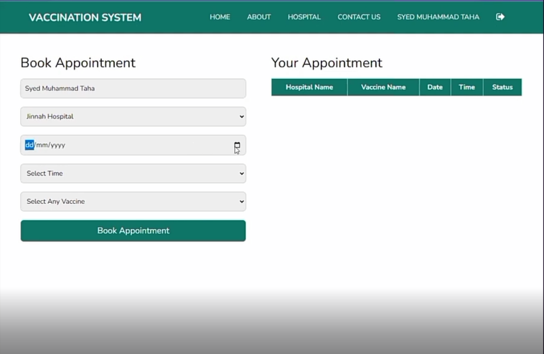

# PHP Vaccination System

The **PHP Vaccination System** is a powerful and user-friendly web application designed to streamline the process of vaccination appointment booking. Built with **PHP** and **MySQL**, it provides patients with a secure and personalized portal to manage their healthcare journey efficiently.

## 🚀 Key Features

- 🗓️ **Appointment Booking**: Patients can easily schedule their vaccination appointments online.
- 🔐 **Secure Login System**: Personalized access for patients with protected user authentication.
- 📄 **Vaccination Report Viewing**: View and download vaccination history and reports.
- 🧭 **User-Friendly Interface**: Clean and intuitive design for better user experience.
- 🧩 **Admin Panel**: Manage users, appointments, and vaccination records.
- 🛡️ **Data Security**: Ensures secure handling of user data and sensitive information.

## 🛠️ Technologies Used

- **Frontend**: HTML5, CSS3, JavaScript
- **Backend**: PHP 7+
- **Database**: MySQL

## 📈 SEO Benefits

This PHP Vaccination System includes optimized code and content structure to improve online discoverability. With keywords like *PHP vaccination booking system*, *online vaccine appointment*, and *healthcare management portal*, this project is built to rank well in search engines.


## 🌟 Website UI
  
  


## 💡 Use Cases

- Hospitals and clinics offering vaccination services
- Government health departments
- Educational projects for PHP and MySQL learners
- Healthcare management systems

## 🔧 Installation Guide

1. Clone the repository.
2. Import the SQL database (`database.sql`) into your MySQL server.
3. Update the database credentials in `config.php`.
4. Run the app on a local or live server with PHP support.

```bash
git clone https://github.com/yourusername/php-vaccination-system.git
